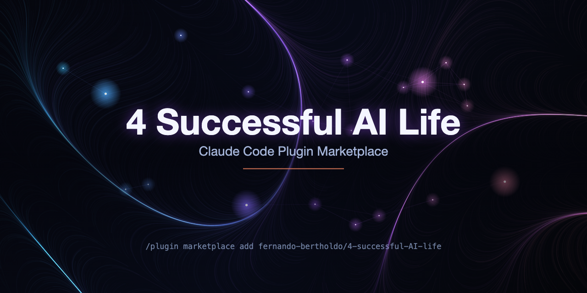

<div align="center">



# 4 Successful AI Life

**A curated [Claude Code](https://code.claude.com) plugin marketplace — opinionated, production-ready skills for AI-assisted work.**

[](./LICENSE)
[](./.claude-plugin/marketplace.json)
[](https://code.claude.com)

[Quick Start](#-quick-start) · [Plugins](#-plugins) · [Installation](#-installation) · [Roadmap](#-roadmap) · [Maintainer docs](#-contributing--maintainer-docs)

</div>

---

A personal marketplace of [Claude Code](https://code.claude.com) plugins by [Fernando Bertholdo](https://github.com/fernando-bertholdo), focused on craft, rigor, and practical excellence. Every plugin is self-contained, documented, and installable in seconds through Claude Code's native plugin system.

## 🚀 Quick Start

Inside any Claude Code session, add the marketplace and install the plugins you want:

```
/plugin marketplace add fernando-bertholdo/4-successful-AI-life
/plugin install ui-excellence@4-successful-ai-life
/plugin install smart-session-rename-cc@4-successful-ai-life
/plugin install prompt-master@4-successful-ai-life
/plugin install generate-session-prompt@4-successful-ai-life
/plugin install enhanced-planning@4-successful-ai-life
/reload-plugins
```

Drop any line you don't want — every plugin is independent. After reload, skills are invocable as slash commands (`/ui-excellence:accessibility`, `/smart-rename`, `/generate-session-prompt`, `/enhanced-planning`); `prompt-master` is model-invoked and needs no command — just ask Claude to work on a prompt. Other install paths (local clone, single-plugin test, permanent opt-in) are in [Installation](#-installation).

## 🧩 Plugins

| Plugin | Version | What it does |
|---|---|---|
| [**ui-excellence**](./plugins/ui-excellence/) | `1.0.0-alpha.3` | UI/UX skill bundle with a triage coordinator — visual design, typography, accessibility, usability audits, CRO, microinteractions, and engagement loops. |
| [**smart-session-rename-cc**](./plugins/smart-session-rename-cc/) | `1.5.0` | Auto-names your Claude Code sessions from the work you actually do, via a Stop hook + a Haiku-generated title. |
| [**prompt-master**](./plugins/prompt-master/) | `1.0.0+upstream-1.7.0` | Generates optimized prompts for any AI tool (LLMs, image/video AI, coding agents). Activates only on explicit prompt-engineering requests. |
| [**generate-session-prompt**](./plugins/generate-session-prompt/) | `1.0.1+upstream-4.0.0` | Generates a handoff prompt to resume work in a new session — for long sessions, pauses, or tool switches. |
| [**enhanced-planning**](./plugins/enhanced-planning/) | `1.0.0+upstream-2.0.0` | Adds structural guardrails to implementation plans — human checkpoints, risk registry, decision locks, multi-session protocol, and Codex review. Complements `writing-plans`. |

<details>
<summary><b>🎨 ui-excellence</b> — UI/UX craft, framework-agnostic</summary>

<br>

13 skills (12 specialists + 1 triage coordinator) for building and auditing web interfaces, grouped into **Foundations** (`animation-motion`, `visual-polish`, `web-standards`, `accessibility`), **Systems** (`refactoring`, `typography`), **Audit** (`heuristics`, `cro`), **Interaction** (`microinteractions`), and **Behavior** (`hooked`, `retention`, `copy`).

Foundations are original; the Systems, Audit, Interaction, and Behavior groups are adapted from [`wondelai/skills`](https://github.com/wondelai/skills) (MIT, with attribution — see the [plugin LICENSE](./plugins/ui-excellence/LICENSE)).

Invoke any skill directly when you need targeted guidance:

```
/ui-excellence:visual-polish      # spacing, shadows, optical alignment
/ui-excellence:accessibility      # WCAG 2.1 AA — keyboard, ARIA, contrast
/ui-excellence:heuristics         # Nielsen + Krug usability audit
/ui-excellence:cro                # conversion-rate optimization audit
```

…or let the `_coordinator` triage your task and route to the right specialist. → [Plugin README](./plugins/ui-excellence/README.md)

</details>

<details>
<summary><b>✍️ smart-session-rename-cc</b> — never hunt through <code>quirky-blue-elephant</code> again</summary>

<br>

A Stop hook scores work-density deterministically and asks Haiku for a structured `domain: clause` title once meaningful work has accumulated — so a random `quirky-blue-elephant` becomes `auth: add rate limiting, tests`. It stays quiet during Q&A and only spends a call when real code is happening.

Seven `/smart-rename` subcommands keep you in control:

```
/smart-rename            # suggest a title now
/smart-rename explain    # show the current state snapshot
/smart-rename <name>     # anchor a domain (e.g. /smart-rename billing)
/smart-rename freeze     # pause auto-rename  (unfreeze to resume)
/smart-rename force      # override the throttle / reset the circuit breaker
/smart-rename unanchor   # clear the domain anchor
```

→ [Plugin README](./plugins/smart-session-rename-cc/README.md)

</details>

<details>
<summary><b>💬 prompt-master</b> — optimized prompts for any AI tool</summary>

<br>

Model-invoked — no slash command. It activates automatically when you explicitly ask Claude to write, fix, improve, or adapt a prompt for a specific AI tool, and stays out of the way during general conversation or coding. Just ask:

> "Improve this Midjourney prompt: a cabin in the woods at dusk…"
>
> "Write a system prompt for a coding agent that reviews pull requests."

Vendored from [`nidhinjs/prompt-master`](https://github.com/nidhinjs/prompt-master) and synced weekly. → [Plugin README](./plugins/prompt-master/README.md)

</details>

<details>
<summary><b>🔄 generate-session-prompt</b> — resume work without losing context</summary>

<br>

Generates a structured handoff prompt so you can pick up in a fresh session after a long run, a pause, or a tool switch. Dual-mode: **opinionated** when a `.planning/` directory exists in the project root, **generic** otherwise — so it's useful in any repo.

```
/generate-session-prompt            # mode auto-detected
/generate-session-prompt detailed   # detail level: brief | standard | detailed
```

Vendored from [`tech-product-template`](https://github.com/fernando-bertholdo/tech-product-template) and synced weekly. → [Plugin README](./plugins/generate-session-prompt/README.md)

</details>

<details>
<summary><b>🧭 enhanced-planning</b> — structural guardrails for implementation plans</summary>

<br>

Adds structural guardrails to a plan *before* you write it: human checkpoints, a risk registry, named guardrails (`G-*`), decision locks, a multi-session continuity protocol, and a Codex review pass. It complements `writing-plans` (from [superpowers](https://github.com/obra/superpowers)) — `enhanced-planning` shapes the plan's structure, then `writing-plans` fills in the content.

Use it when a task spans 3+ PRs or multiple sessions, touches stakeholder-visible output, or risks drift between components.

```
/enhanced-planning checkout-v2    # guardrails for a unit of work
/enhanced-planning                # guardrails, no specific label
```

It originates from a milestone/detour planning framework but works standalone — a "Standalone usage" preamble in the skill maps the jargon and marks companion skills as optional. Pairs with `writing-plans` and [`/codex:rescue`](https://github.com/openai/codex-plugin-cc) (OpenAI's official Codex plugin for Claude Code).

Vendored from [`tech-product-template`](https://github.com/fernando-bertholdo/tech-product-template) and synced weekly. → [Plugin README](./plugins/enhanced-planning/README.md)

</details>

## 📦 Installation

The [Quick Start](#-quick-start) above is the recommended path — install from GitHub. Other ways to install:

<details>
<summary><b>From a local clone</b> (for development)</summary>

<br>

Clone the repository and add the local path as a marketplace:

```bash
git clone https://github.com/fernando-bertholdo/4-successful-AI-life.git
cd 4-successful-AI-life
```

Then, inside a Claude Code session launched from the clone directory:

```
/plugin marketplace add ./
/plugin install ui-excellence@4-successful-ai-life
/reload-plugins
```

Useful when you want to hack on a plugin locally before pushing changes.

</details>

<details>
<summary><b>Single-plugin test via <code>--plugin-dir</code></b></summary>

<br>

Bypass the marketplace entirely and load one plugin directly:

```bash
claude --plugin-dir ./plugins/ui-excellence
```

Handy for validating a plugin in isolation without touching your global marketplace registry.

</details>

<details>
<summary><b>Permanent opt-in via <code>settings.json</code></b></summary>

<br>

To auto-install in a project, add to `.claude/settings.json`:

```json
{
  "extraKnownMarketplaces": {
    "4-successful-ai-life": {
      "source": {
        "source": "github",
        "repo": "fernando-bertholdo/4-successful-AI-life"
      }
    }
  },
  "enabledPlugins": {
    "ui-excellence@4-successful-ai-life": true,
    "smart-session-rename-cc@4-successful-ai-life": true,
    "prompt-master@4-successful-ai-life": true,
    "generate-session-prompt@4-successful-ai-life": true,
    "enhanced-planning@4-successful-ai-life": true
  }
}
```

Claude Code prompts you to trust the marketplace on first open, then keeps the plugins available across sessions.

</details>

## 🗺️ Roadmap

- **`ui-excellence` v1.0.0** — graduate from `alpha`: finalize the coordinator's path-aware auto-loading and integration cleanup.
- **`smart-session-rename-cc` v1.5.1** — fix two CLI-path bugs surfaced during Level 4 testing (state empty-write under degenerate transcripts; `/smart-rename force` state divergence).
- **`planning-suite`** — bundle the milestone/detour planning family (`init-milestone`, `validate-dor`/`dod`, `archive-initiative`, …) around the already-shipped `enhanced-planning`, so its companion-skill references resolve within one plugin.
- **Future plugins** — focused bundles (sync, design-sprint workflows) extracted from long-running real-world use.

## 📄 License

MIT — see [LICENSE](./LICENSE). Individual plugins may carry additional attribution in their own `LICENSE` files when they incorporate third-party content.

## 🤝 Contributing & maintainer docs

This marketplace is maintained for personal and project-specific use. External contributions aren't actively solicited, but issues and discussion are welcome on the [issue tracker](https://github.com/fernando-bertholdo/4-successful-AI-life/issues).

- **How plugins are built, vendored, versioned, and synced** → [`CONTRIBUTING.md`](./CONTRIBUTING.md)
- **Repo conventions & the anti-drift checklist** → [`CLAUDE.md`](./CLAUDE.md)

---

<div align="center">

If a plugin here saves you time, a ⭐ helps others discover the marketplace.

</div>
